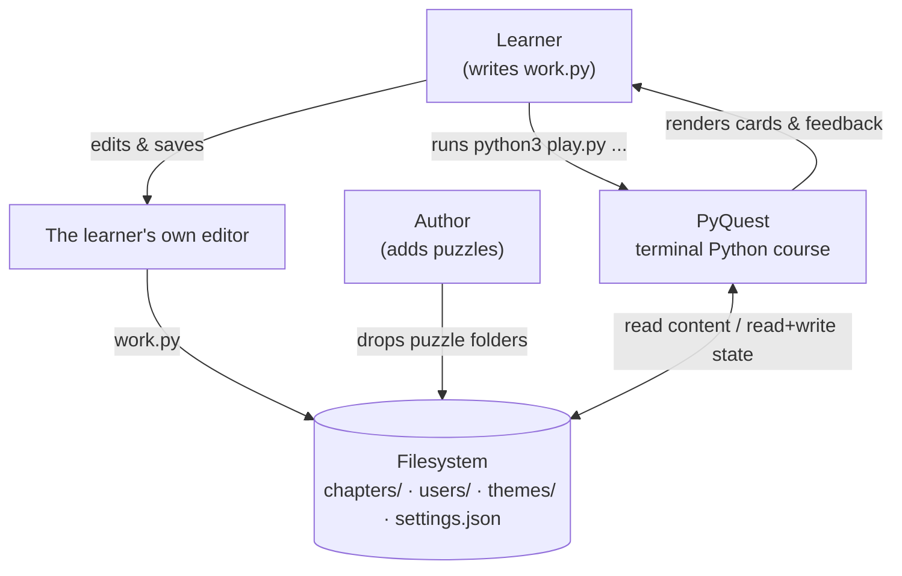
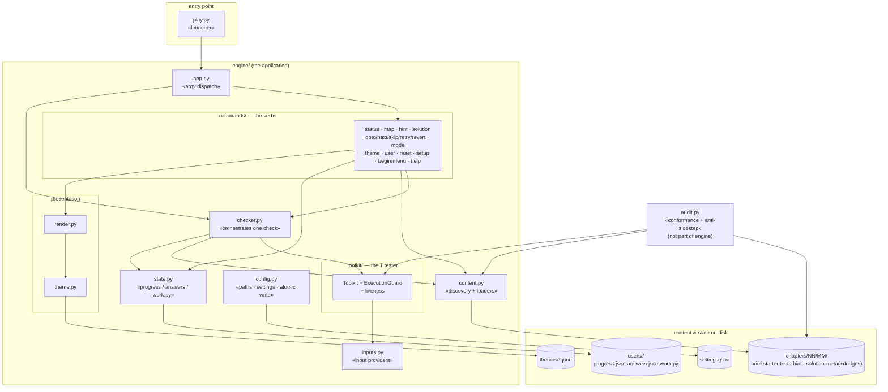
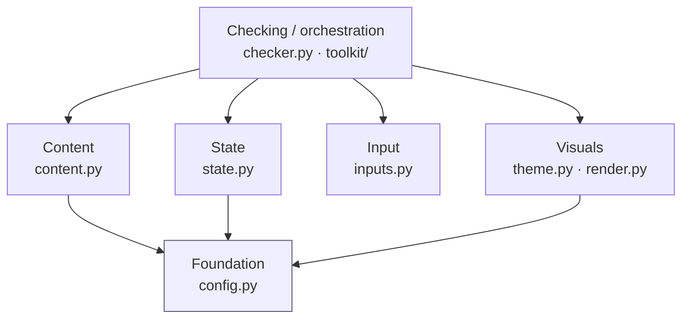
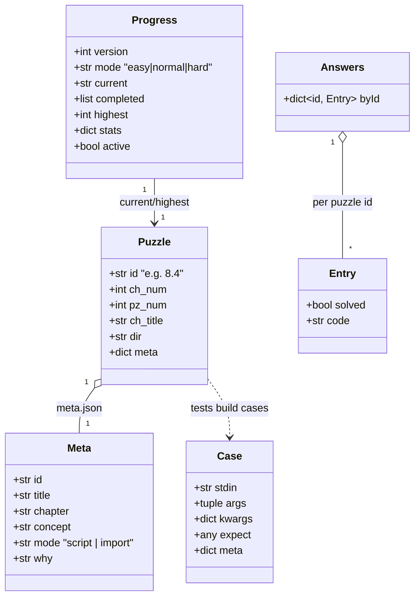
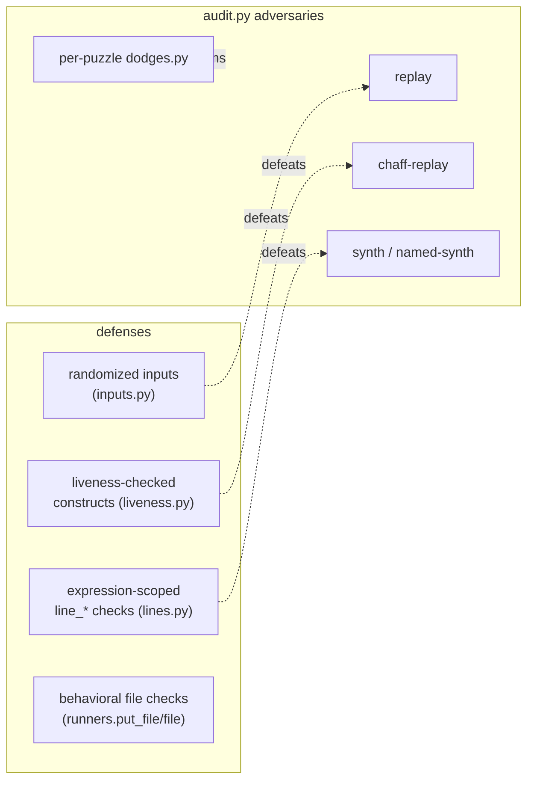

# PyQuest — Architecture (UML)

A UML view of PyQuest's design. The diagrams are written in [Mermaid](https://mermaid.js.org)
so they render directly on GitHub and in most Markdown/IDE viewers.

This page is the **overview**. Each module group has its own page with
module‑level class diagrams and the relevant sequences:

| Page | Covers |
|---|---|
| **[engine-core.md](engine-core.md)** | `app`, `config`, `content`, `inputs`, `state`, `checker` |
| **[toolkit.md](toolkit.md)** | the `T` tester: `Toolkit` facade, mixins, `ExecutionGuard`, liveness, errors |
| **[commands.md](commands.md)** | the verb package (`commands/`) and argv dispatch |
| **[visuals.md](visuals.md)** | `theme`, `render` — the isolated presentation layer |
| **[audit.md](audit.md)** | `audit.py` — conformance, the anti‑sidestep attack suite, engine self‑test |

> **Notation.** Python here is mostly module‑level functions, not classes, so a
> file is drawn as a UML class with the «module» stereotype: its functions are
> listed as operations and its module constants as attributes. Genuine classes
> (`Toolkit`, `ExecutionGuard`, the error hierarchy) are drawn as ordinary
> classes. Dependencies point **downward**: a box only knows about the boxes
> below it.

---

## 1. System context (C4 level 1)

PyQuest is a **stateless command runner**, not a TUI: every invocation is one
short `python3 play.py <verb>` that reads content + per‑user state from disk,
does one thing, prints, and exits. The only interactive surface is the `begin`
menu. There are **no third‑party dependencies** (Python 3.8+ stdlib only).

## 2. Containers & components (C4 level 2)

## 3. Layered architecture (the five concerns that never bleed)

**Invariants** (verified by `audit.py` + the docs in `../../ARCHITECTURE.md`):

| Rule | Where it lives |
|---|---|
| A new **puzzle** is files on disk only — zero code change | `content.discover()` auto‑scans |
| A new **command** → one `commands/` module + one dispatch line | `app.main()` |
| A new **validation helper** → one `toolkit/` module | `Toolkit` mixins |
| All in‑process learner code runs through **one guard** | `ExecutionGuard.guarded()` |
| Colours/glyphs/boxes exist **only** in the visual layer | `theme.py` / `render.py` |
| Every JSON write is **atomic** (temp + rename); a corrupt file is moved aside | `config.write_json` · `state.backup_corrupt` |

## 4. Domain model (the data a check moves through)

## 5. Key runtime sequence — `python3 play.py check`

The five translated failure types (`toolkit/errors.py`) each map to a distinct
learner‑facing screen — see [toolkit.md](toolkit.md) and [engine-core.md](engine-core.md).

## 6. Anti‑sidestep posture (why the grader is hard to cheat)

Detailed in [audit.md](audit.md). The manual counterpart lives in the
(gitignored) `SIDESTEP_PLAYBOOK.md`.
