# PyQuest: Architecture (UML)

A UML view of PyQuest's design. The diagrams are written in [Mermaid](https://mermaid.js.org)
so they render directly on GitHub and in most Markdown/IDE viewers.

This page is the **overview**. Each module group has its own page with
module‑level class diagrams and the relevant sequences:

| Page | Covers |
|---|---|
| **[engine-core.md](engine-core.md)** | `app`, `config`, `content`, `inputs`, `state`, `checker` |
| **[toolkit.md](toolkit.md)** | the `T` tester: `Toolkit` facade, mixins, `ExecutionGuard`, liveness, errors |
| **[commands.md](commands.md)** | the verb package (`commands/`) and argv dispatch |
| **[visuals.md](visuals.md)** | `theme`, `render`, the isolated presentation layer |
| **[audit.md](audit.md)** | `audit.py`, conformance, the anti‑sidestep attack suite, engine self‑test |

> **Notation.** Python here is mostly module‑level functions, not classes, so a
> file is drawn as a UML class with the «module» stereotype: its functions are
> listed as operations and its module constants as attributes. Genuine classes
> (`Toolkit`, `ExecutionGuard`, the error hierarchy) are drawn as ordinary
> classes. Dependencies point **downward**: a box only knows about the boxes
> below it.

---

## 0. Master diagrams (every module & class)

The whole system as two clean panels — split so the layout stays untangled:
**0.1** the engine modules (the import graph) and **0.2** the tester
(`Toolkit`) class hierarchy. Together they cover every module and genuine class;
the per-area pages below add the per-verb and run/liveness detail. `─▷` (hollow
arrow) is inheritance, `┄▷` (dashed) a dependency (import/use).

### 0.1 Engine modules

«module» boxes and their import graph, reading left to right: entry → dispatch →
services → foundation. `i18n` localizes content and UI strings; `inputs` is the
authoring seam — no engine module imports it, a puzzle's `tests.py` does, building
`Case`s. Everything bottoms out at `config`. (`checker` → `toolkit/` is in §4.2.)

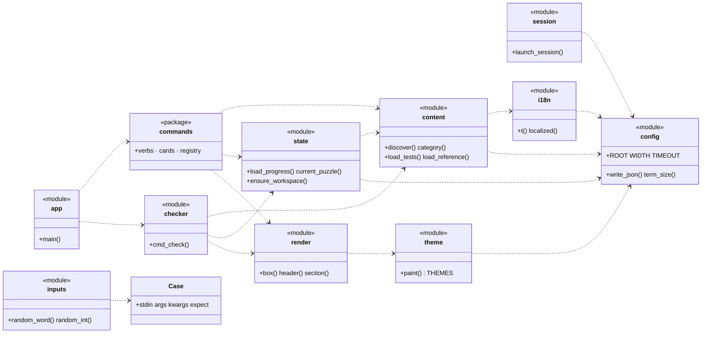

### 0.2 The tester (`Toolkit`) classes

The genuine classes behind a `check`: the `Toolkit` facade composes six method
mixins; every run of learner code funnels through the one `ExecutionGuard`; and
failures are the translated `PuzzleError` hierarchy (`LessonNotUsedError` is a
`WrongResultError`, so its `except` must come first). `checker` is the only
module that touches this package.

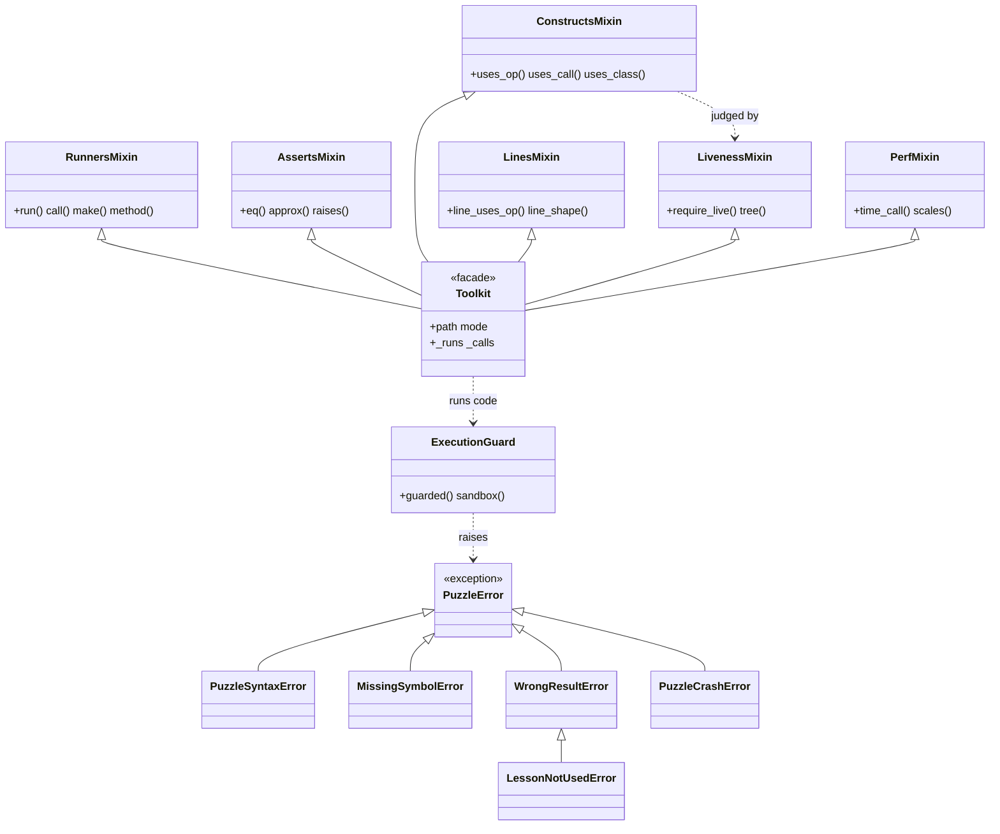
---

## 1. System context (C4 level 1)

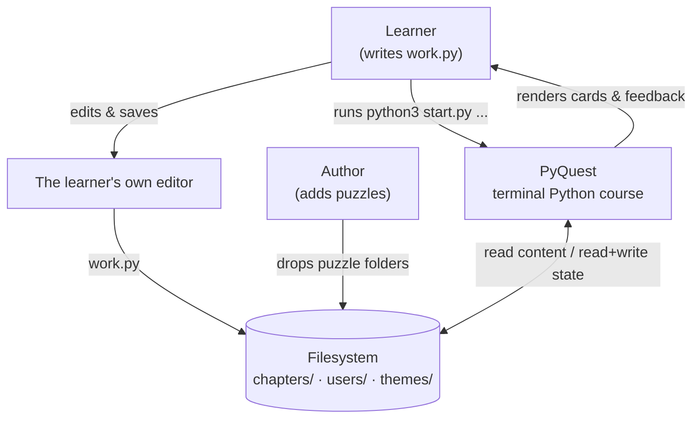

PyQuest is a **stateless command runner**, not a TUI: every invocation is one
short `python3 start.py <verb>` that reads content + per‑user state from disk,
does one thing, prints, and exits. The interactive surfaces are the `menu`
launcher and the **play cockpit** (the card's arrow‑selectable nav row); both
engage only on a key‑capable TTY and degrade to plain prints otherwise. There
are **no third‑party dependencies** (Python 3.8+ stdlib only).

## 2. Containers (C4 level 2)

The runnable units and the stores they read/write, kept deliberately coarse.
The engine's internal **components** are the next level down: see §3 (layers)
and the per‑module pages.

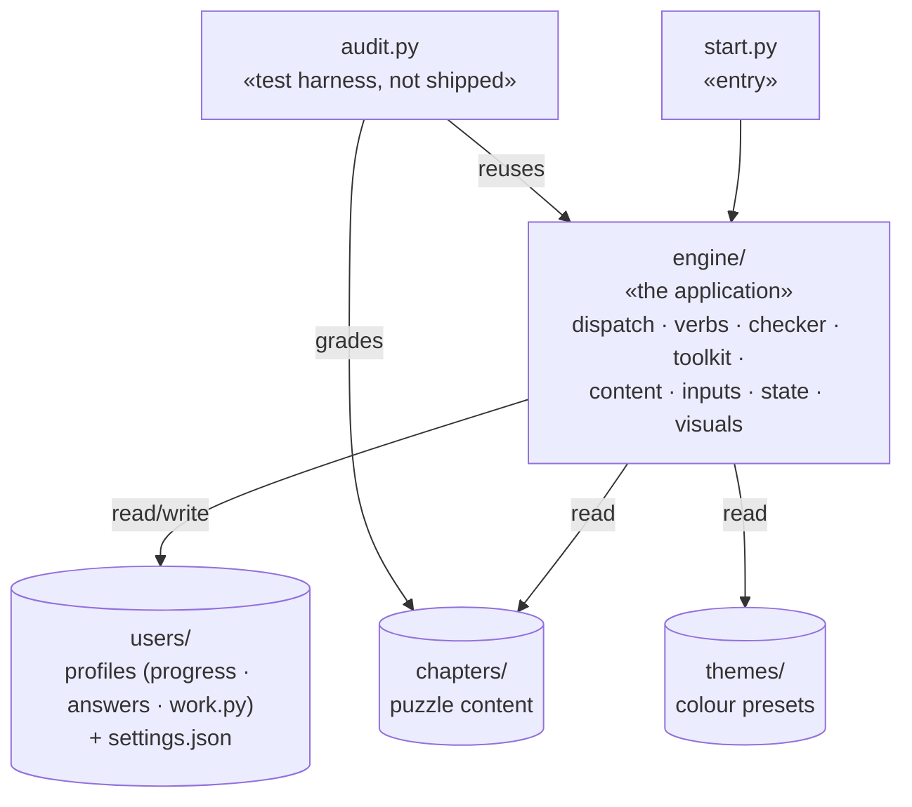

## 3. Layered architecture (the five concerns that never bleed)

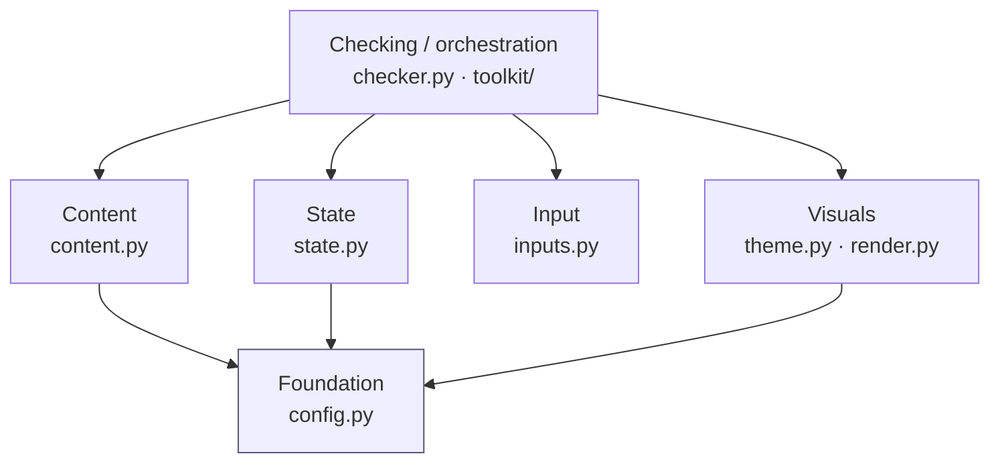

**Invariants** (verified by `audit.py` + the docs in `../ARCHITECTURE.md`):

| Rule | Where it lives |
|---|---|
| A new **puzzle** is files on disk only, zero code change | `content.discover()` auto‑scans |
| A new **command** → one `commands/` module + one dispatch line | `app.main()` |
| A new **validation helper** → one `toolkit/` module | `Toolkit` mixins |
| All in‑process learner code runs through **one guard** | `ExecutionGuard.guarded()` |
| Colours/glyphs/boxes exist **only** in the visual layer | `theme.py` / `render.py` |
| Every JSON write is **atomic** (temp + rename); a corrupt file is moved aside | `config.write_json` · `state.backup_corrupt` |

## 4. Engine components (C4 level 3)

The wiring *inside* the `engine/` container. §0 (the master diagram) is the full
structural picture; the two flows here add the direction and edge labels a class
diagram can't carry. Arrows point **toward the dependency** (A → B means "A
imports B"); verify with `grep -rE "^from \.\.?" engine`. The per‑verb edges into
the data and visual layers live in [commands.md](commands.md); the tester in
[toolkit.md](toolkit.md).

### 4.1 Dispatch & verbs

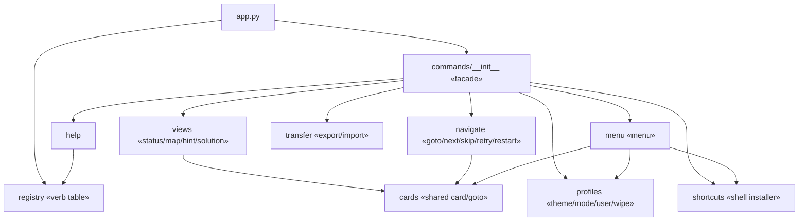

Only `cards` is shared and `menu` composes the other verbs, so adding a verb
touches one module plus one `elif` in `app.main()`. (Each verb's edges to
`content`/`state`/`render` are in [commands.md](commands.md).)

### 4.2 The check path

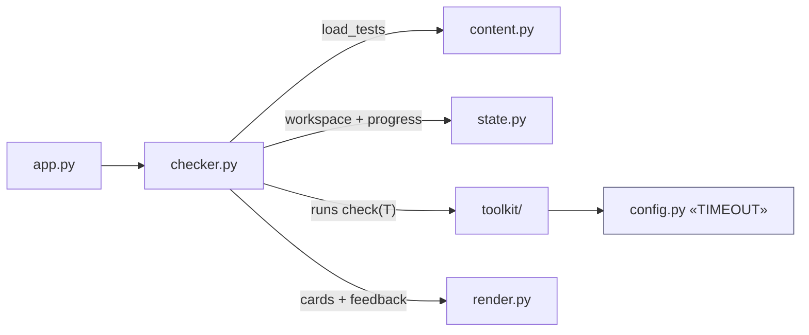

`checker` is the only module that touches the `toolkit`; the §6 sequence traces
this path end to end. The data, visual, and foundation wiring (`state`→`content`,
`content`→`i18n`/`config`, `render`→`theme`, the `inputs` seam) and the toolkit's
internal composition are in §0's master diagram; [toolkit.md](toolkit.md) zooms
into the tester.

## 5. Domain model (the data a check moves through)

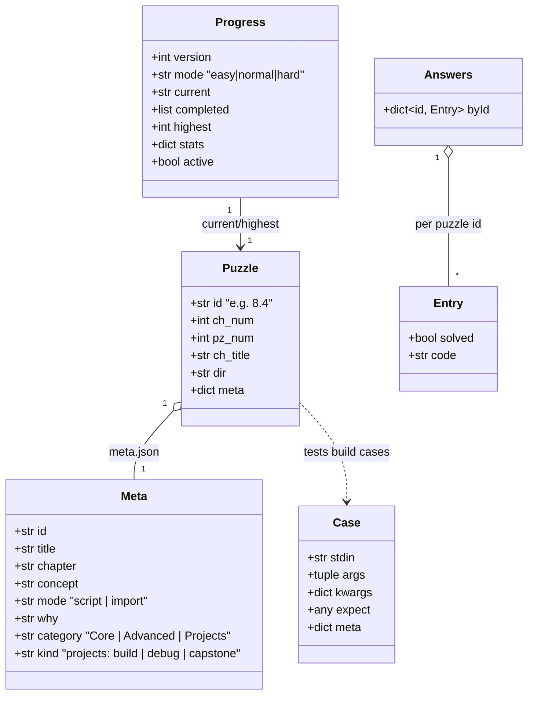

### How the system consumes a puzzle

A puzzle is a handful of files on disk; each has exactly one job and one reader.
This is the whole interaction surface between the engine and the content.

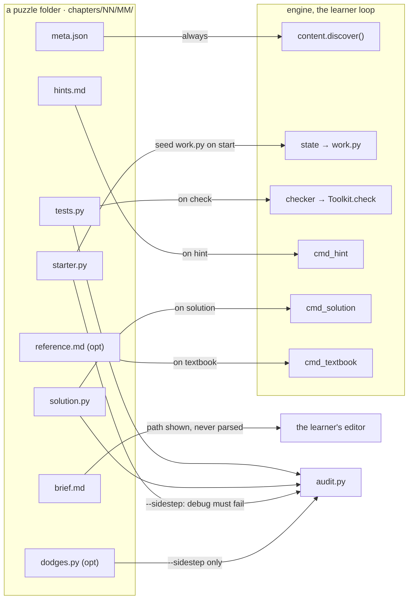

`meta.json` is the only file loaded for *every* puzzle (discovery reads id, mode,
category, kind); `brief.md` is never parsed — the engine shows its path and the
learner opens it; `reference.md` feeds the textbook; `tests.py`, `solution.py`,
`starter.py` (for debug puzzles), and `dodges.py` are what `audit.py` grades
against. Adding a puzzle is dropping these files on disk, zero code changes.

## 6. Key runtime sequence: `python3 start.py check`

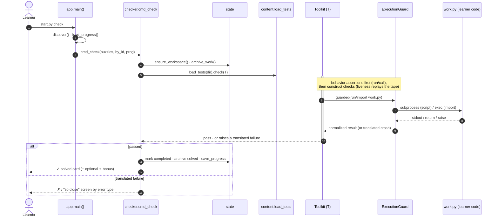

The five translated failure types (`toolkit/errors.py`) each map to a distinct
learner‑facing screen, see [toolkit.md](toolkit.md) and [engine-core.md](engine-core.md).

## 7. Anti‑sidestep posture (why the grader is hard to cheat)

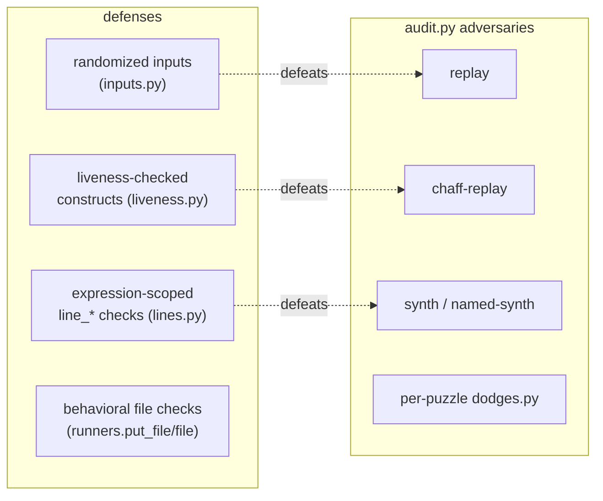

Each generic adversary has a structural defense (the dashed pairs).
**Behavioral file checks** add cover for write puzzles, the impostors
reproduce stdout, not files, and **per‑puzzle `dodges.py`** pins every
hand‑found sidestep as a permanent regression. Detailed in [audit.md](audit.md).
