# PyQuest: Architecture (UML)

A UML view of PyQuest's design. The diagrams are written in [Mermaid](https://mermaid.js.org)
so they render directly on GitHub and in most Markdown/IDE viewers.

This page is the **overview**. Each module group has its own page with
module‑level class diagrams and the relevant sequences:

| Page | Covers |
|---|---|
| **[engine-core.md](engine-core.md)** | `app`, `config`, `content`, `inputs`, `state`, `checker` |
| **[toolkit.md](toolkit.md)** | the `T` tester: `Toolkit` facade, mixins, `ExecutionGuard`, liveness, errors |
| **[commands.md](commands.md)** | the verb package (`commands/`) and argv dispatch |
| **[visuals.md](visuals.md)** | `theme`, `render`, the isolated presentation layer |
| **[audit.md](audit.md)** | `audit.py`, conformance, the anti‑sidestep attack suite, engine self‑test |

> **Notation.** Python here is mostly module‑level functions, not classes, so a
> file is drawn as a UML class with the «module» stereotype: its functions are
> listed as operations and its module constants as attributes. Genuine classes
> (`Toolkit`, `ExecutionGuard`, the error hierarchy) are drawn as ordinary
> classes. Dependencies point **downward**: a box only knows about the boxes
> below it.

---

## 1. System context (C4 level 1)

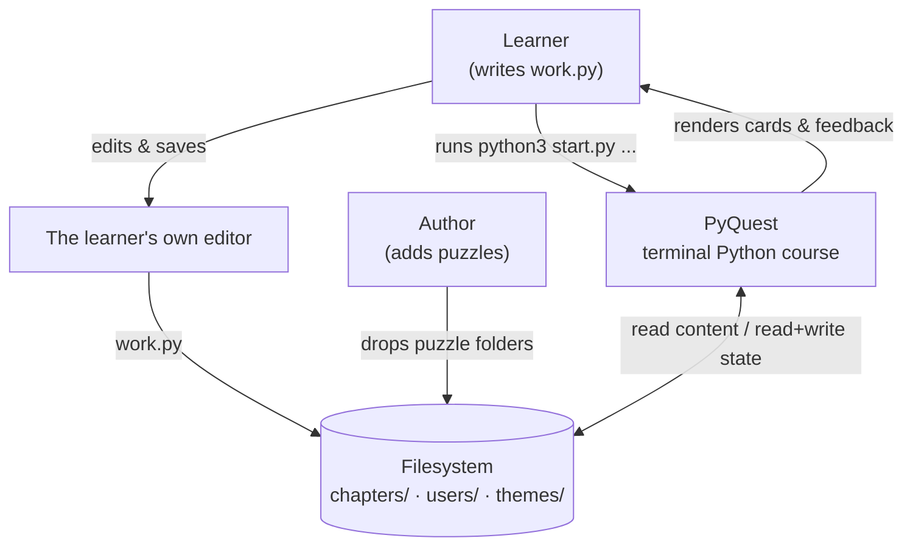

PyQuest is a **stateless command runner**, not a TUI: every invocation is one
short `python3 start.py <verb>` that reads content + per‑user state from disk,
does one thing, prints, and exits. The only interactive surface is the `menu`
menu. There are **no third‑party dependencies** (Python 3.8+ stdlib only).

## 2. Containers (C4 level 2)

The runnable units and the stores they read/write, kept deliberately coarse.
The engine's internal **components** are the next level down: see §3 (layers)
and the per‑module pages.

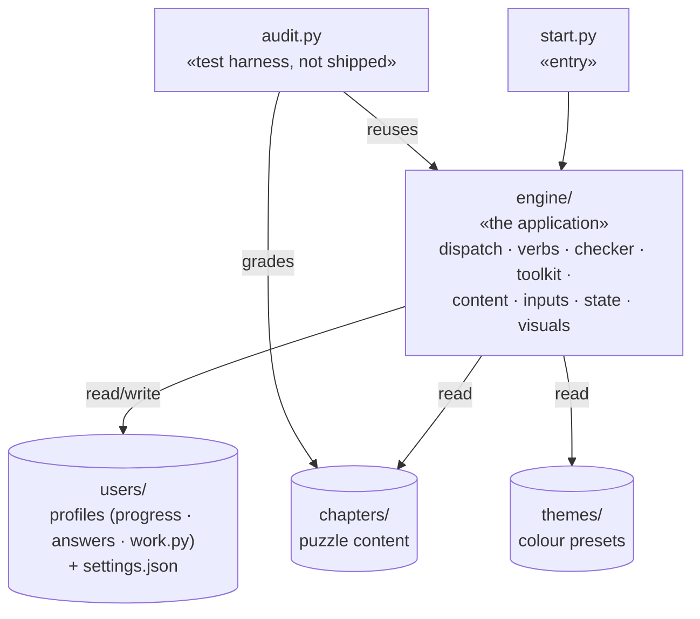

## 3. Layered architecture (the five concerns that never bleed)

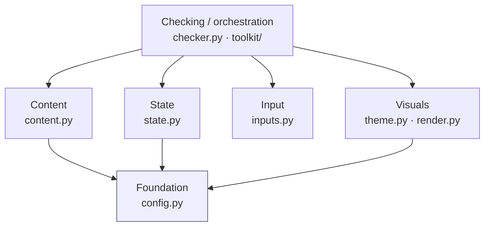

**Invariants** (verified by `audit.py` + the docs in `../ARCHITECTURE.md`):

| Rule | Where it lives |
|---|---|
| A new **puzzle** is files on disk only, zero code change | `content.discover()` auto‑scans |
| A new **command** → one `commands/` module + one dispatch line | `app.main()` |
| A new **validation helper** → one `toolkit/` module | `Toolkit` mixins |
| All in‑process learner code runs through **one guard** | `ExecutionGuard.guarded()` |
| Colours/glyphs/boxes exist **only** in the visual layer | `theme.py` / `render.py` |
| Every JSON write is **atomic** (temp + rename); a corrupt file is moved aside | `config.write_json` · `state.backup_corrupt` |

## 4. Engine components (C4 level 3)

The wiring *inside* the `engine/` container, shown as one coarse view plus
three focused slices so each stays small. Arrows point **toward the dependency**
(A → B means "A imports B"); verify the edges with
`grep -rE "^from \.\.?" engine`. `config` is the universal foundation imported
widely, so it appears only where a slice needs it. The per‑verb edges into the
data and visual layers live in [commands.md](commands.md); the tester in
[toolkit.md](toolkit.md).

### 4.1 At a glance

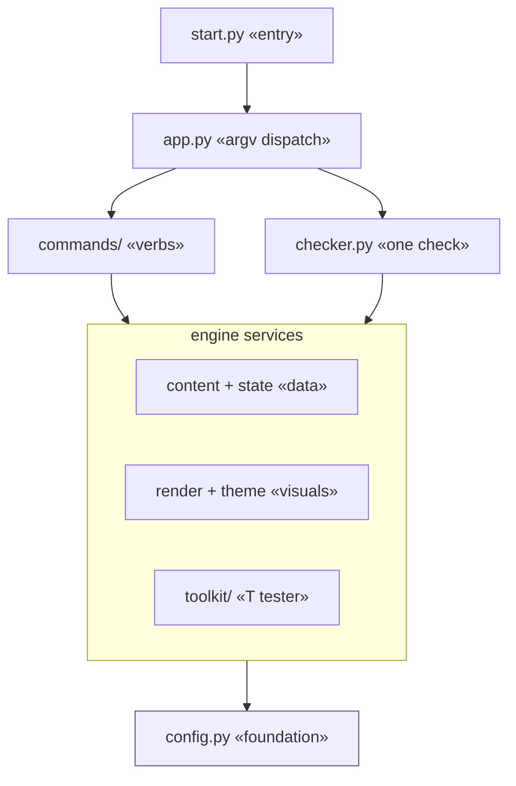

Four tiers, no cycles: the **entry** starts **dispatch**, which routes each
command to the **verbs** or the **checker**; both lean on the shared **services**
(data, visuals, the tester), and everything bottoms out at **config**. The three
slices below zoom in, including which services each branch imports.

### 4.2 Dispatch & verbs

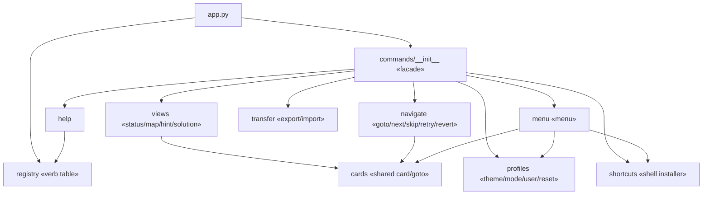

Only `cards` is shared and `menu` composes the other verbs, so adding a verb
touches one module plus one `elif` in `app.main()`. (Each verb's edges to
`content`/`state`/`render` are in [commands.md](commands.md).)

### 4.3 The check path

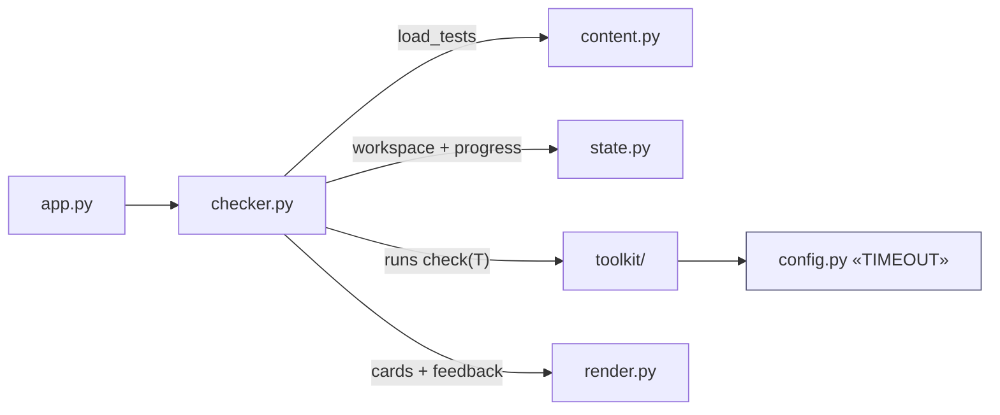

`checker` is the only module that touches the `toolkit`; the §6 sequence traces
this path end to end.

### 4.4 Data, visuals & foundation

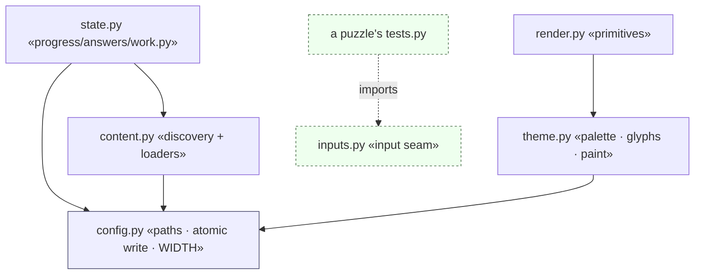

The bottom layers. `inputs` is intentionally an island, no engine module
imports it; only a puzzle's `tests.py` does (the authoring seam, dashed).

### 4.5 Inside the toolkit

The `toolkit/` box is itself a small package: a thin `Toolkit` facade that
composes method groups (mixins) over one shared sandbox. Coarse shape here; the
class‑level composition and the run/liveness sequences are in
[toolkit.md](toolkit.md).

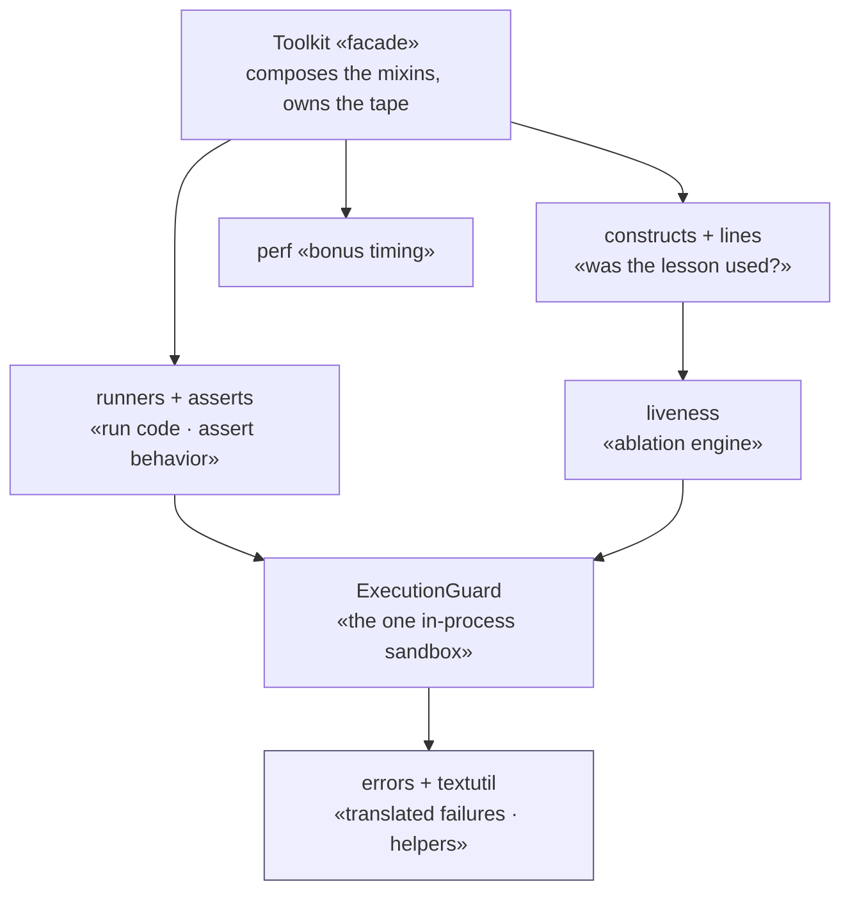

The dependency spine runs downward: the integrity checks lean on `liveness`
(does ablating the construct change behavior?), and every run of learner code,
behavior assertion or liveness re‑run, funnels through the single
`ExecutionGuard`. `perf` is the optional, advisory `bonus(T)` branch.

## 5. Domain model (the data a check moves through)

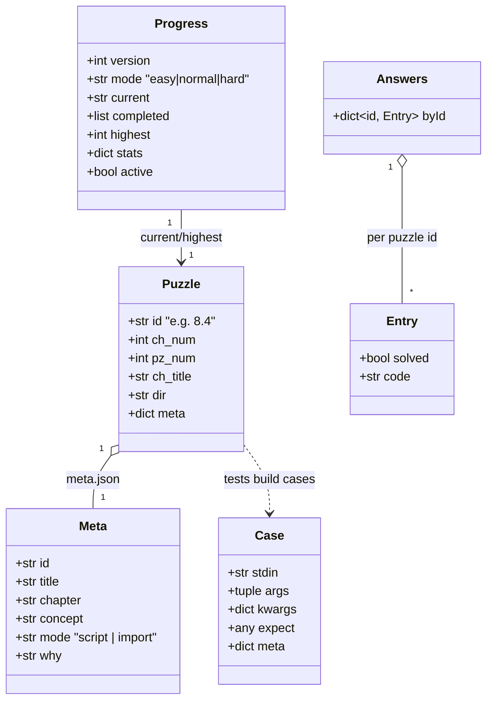

### How the system consumes a puzzle

A puzzle is just seven files on disk; each has exactly one job and one reader.
This is the whole interaction surface between the engine and the content.

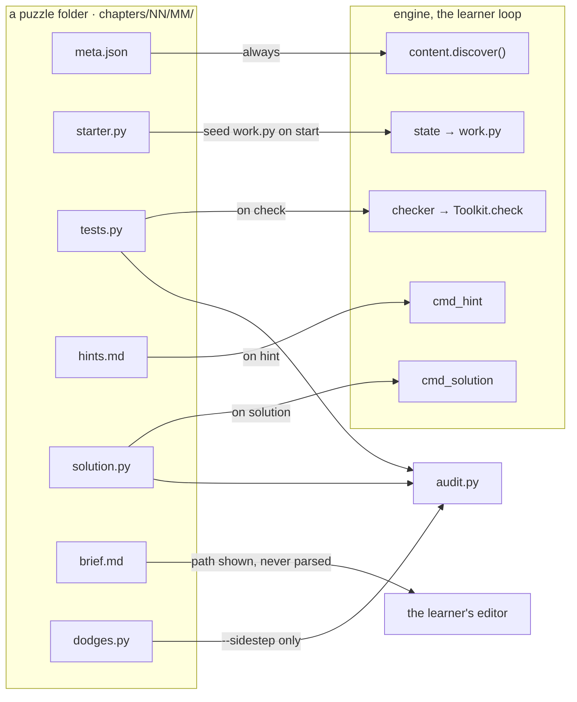

`meta.json` is the only file loaded for *every* puzzle (discovery reads id,
mode, why); `brief.md` is never parsed, the engine just shows its path and the
learner opens it; `tests.py`, `solution.py`, and `dodges.py` are also what
`audit.py` grades against. Adding a puzzle is dropping these files on disk,
zero code changes.

## 6. Key runtime sequence: `python3 start.py check`

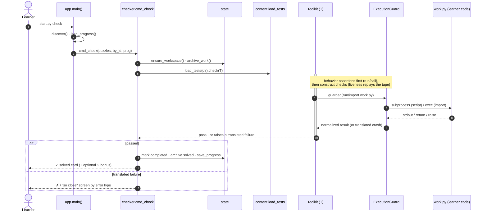

The five translated failure types (`toolkit/errors.py`) each map to a distinct
learner‑facing screen, see [toolkit.md](toolkit.md) and [engine-core.md](engine-core.md).

## 7. Anti‑sidestep posture (why the grader is hard to cheat)

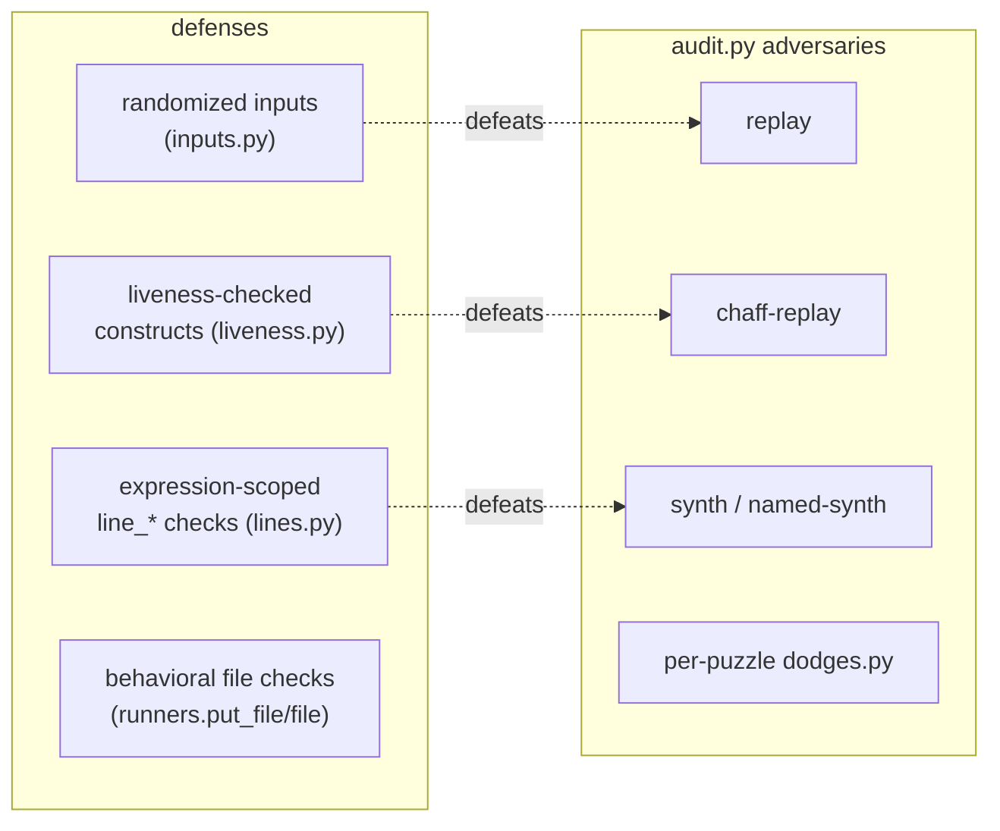

Each generic adversary has a structural defense (the dashed pairs).
**Behavioral file checks** add cover for write puzzles, the impostors
reproduce stdout, not files, and **per‑puzzle `dodges.py`** pins every
hand‑found sidestep as a permanent regression. Detailed in [audit.md](audit.md).
