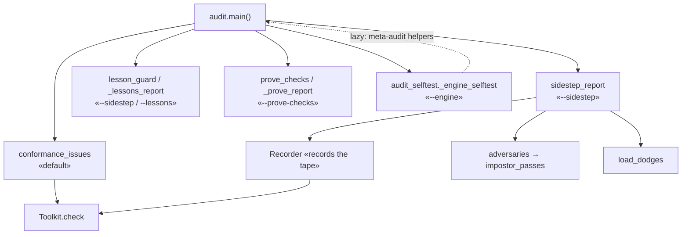
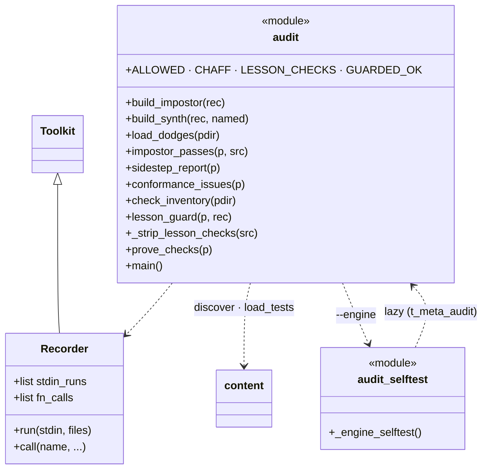
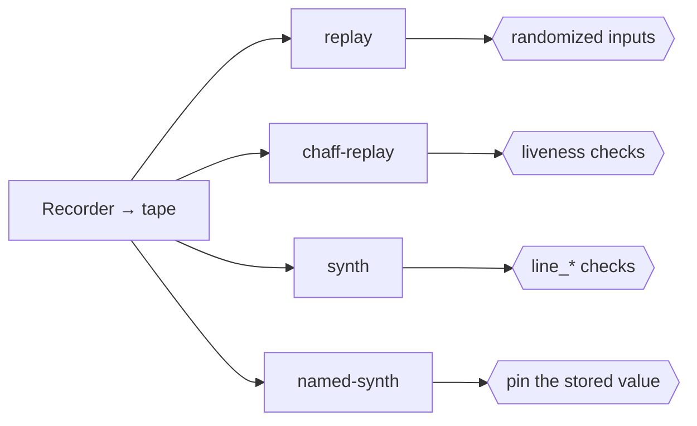
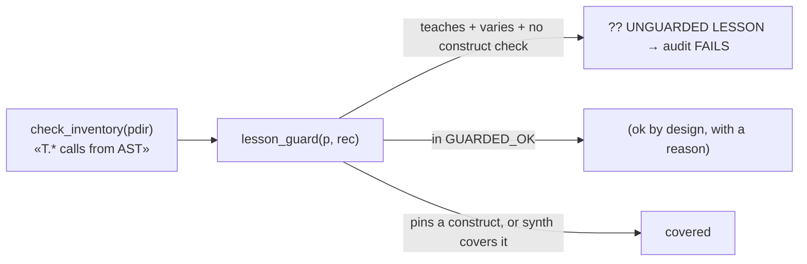
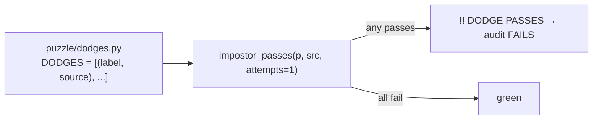
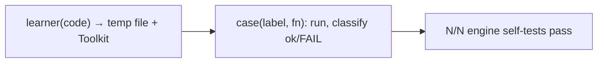

# audit.py: conformance, anti‑sidestep, lesson‑guard, engine self‑test

`audit.py` is the project's executable reality check. It is **not part of the
engine** (safe to delete) and is the test suite: there is no pytest layer.
← [overview](README.md)

```bash
python3 tools/audit.py               # every solution.py passes its own tests.py
python3 tools/audit.py --sidestep    # ALSO attack with the adversaries + lesson-guard
python3 tools/audit.py --lessons     # lesson-guard coverage table (who pins a construct)
python3 tools/audit.py --prove-checks # prove each construct check is load-bearing
python3 tools/audit.py --engine      # self-test the execution guard & toolkit APIs
```

It reuses the real engine (`content.discover/load_tests`, the `Toolkit`), so it
grades against exactly what learners run.

## Two modules, two concerns

The audit splits along the line between *grading the puzzles* and *testing the
engine that does the grading*:

- **`audit.py`** — conformance, the anti‑sidestep adversaries, and the two
  static meta‑audits (lesson‑guard, prove‑checks). All about the **puzzles**.
- **`audit_selftest.py`** — `_engine_selftest()`: ~37 direct cases pinning the
  execution guard, toolkit APIs, and the language-pack plumbing (`i18n`,
  content overrides, the pack validator). All about the **engine**, and
  emphatically *not* "safe to delete". `audit.py --engine` dispatches here; the
  import is one‑way (`audit.py → audit_selftest`), and the self‑test pulls the
  meta‑audit helpers back from `audit.py` lazily inside `t_meta_audit` (no cycle).

Two sibling tools sit alongside, each self-tested from `audit_selftest.py` but
run on their own: **`audit_keys.py`** (`--keys`: the interactive key layer over a
pseudo-terminal) and **`check_pack.py`** (a translator-facing validator that
flags language-pack content overrides mirroring no real puzzle file).



---

## Structure



`ALLOWED` whitelists puzzles where the cheapest passing program is a legitimate
answer; `CHAFF` is dead code holding every construct (to test that liveness
ignores it). `build_impostor`/`build_synth` synthesize the adversaries;
`sidestep_report` returns `(breaches, dodge_passes, guard)` per puzzle.

`Recorder` subclasses the real `Toolkit` so it grades identically while also
capturing the **tape** of every `(stdin → stdout)` and `(call → result)`, the
raw material every adversary is built from.

## The four generic adversaries (mutation testing of the grader)



The Recorder runs the reference solution to capture the **tape**, then four
adversaries answer from it: **replay** (a lookup table, computing nothing),
**chaff-replay** (the table plus `CHAFF`, a never-called function holding every
construct), **synth** (re-derive a fixed output via arithmetic the brief never
asked for), and **named-synth** (the same constants parked in a variable). Each
hexagon is the defense that defeats it.

**A passing impostor is a hole.** Each puzzle should be saved by at least one
defense per adversary. `ALLOWED` whitelists the rare puzzle where the cheapest
passing program *is* a legitimate answer (e.g. 1.1 "print one literal").

The tape only records `run`/`call`, **not** `make`/`method`/`attr`, so the four
adversaries don't fire for object (OOP) puzzles. Those rely instead on
randomized `make`/`method` arguments, `uses_class(name)`, and hand‑pinned
`dodges.py`, which is why the OOP dodges are written out by hand rather than
generated.

## The static meta‑audits: covering the adversaries' blind spot

The adversaries cannot model an **alternative‑construct** sidestep (a program
that computes the right answer with a *different* tool) on a **varying‑output**
puzzle: `synth` only fires on fixed‑output scripts. Two static checks, read from
each `tests.py` source, close that gap, the one that used to be hunted by hand.



- **lesson‑guard** (`--sidestep` gate, `--lessons` table): flags any puzzle that
  has a `concept`, varies its output, and pins **no** construct check
  (`LESSON_CHECKS` = the `uses_*`/`line_*`/`print_*`/… method set). Accepted
  residuals go in `GUARDED_OK` with a written reason, exactly as `ALLOWED` does
  for the dynamic suite (e.g. 3.1: no single comparison op to pin; 6.1/6.2/6.3/
  6.5: import mode forces `def`/params/`return`).
- **prove‑checks** (`--prove-checks`, informational): the converse. For every
  puzzle with both a construct check and a `dodges.py`, `_strip_lesson_checks`
  AST‑removes the construct layer and confirms a pinned dodge then slips through
   — proving the *check*, not a behavioral assert, is what stops it. A dodge
  caught behaviorally is surfaced, not failed (still a valid hardcode
  regression). The OOP puzzles surface here because `uses_class` is AST‑only.

`check_inventory`, `lesson_guard`, and `_strip_lesson_checks` are themselves
pinned by the `t_meta_audit` engine self‑test, so the audit's own reasoning
can't silently rot.

## Per‑puzzle pinned regressions: `dodges.py`



Every known hand‑found sidestep is pinned here with the check that now blocks
it; the audit fails forever if one ever passes again.

## Sequence: `--sidestep` against one puzzle

```mermaid
sequenceDiagram
    autonumber
    participant M as main
    participant SR as sidestep_report
    participant Rec as Recorder
    participant B as builders
    participant IP as impostor_passes
    participant LG as lesson_guard
    participant D as load_dodges

    M->>SR: sidestep_report(p)
    SR->>Rec: run reference solution, record the tape
    SR->>LG: lesson_guard(p, rec) → None / allowed / exposed
    SR->>B: build replay / chaff / synth / named-synth
    loop each adversary
        SR->>IP: impostor_passes(p, src, attempts=2)
        IP->>IP: temp file · fresh tests · Toolkit.check
        IP-->>SR: passed? (a breach if yes)
    end
    SR->>D: load_dodges(dir)
    loop each pinned dodge
        SR->>IP: impostor_passes(p, src, attempts=1)
        IP-->>SR: must be False
    end
    SR-->>M: breaches, dodge_passes, guard
    M-->>M: weak++ on any breach/dodge; unguarded++ on exposed
```

## `--engine`: the guard's guarantees, pinned (in `audit_selftest.py`)

`_engine_selftest()` runs ~34 direct cases asserting each promise the
[ExecutionGuard](toolkit.md) and toolkit make: `exit()`/hang/stray‑`input()`
translation, stdout capture, the file sandbox never leaking into the project,
class/mutation/`approx`/case‑sensitive‑`eq` behavior, liveness killing dead
chaff while honest constructs pass, the `line_*` checks, the structural checks
(`uses_nested_if`, `uses_default_param`, `uses_with_open`, `uses_class(name)`),
atomic JSON writes, corrupt‑file backup, username validation, discovery
tolerating bad meta, the command registry staying in lock‑step with `app.py`
dispatch, the profile‑import sanitizers scrubbing a stale or hand‑edited export
bundle, and the meta‑audit helpers themselves (`t_meta_audit`).



Run order in CI‑of‑one: `--engine` after touching `toolkit/`, `--sidestep`
before any commit; both must be green (current bar: **98/98 conformance,
0/98 sidesteppable, 0/98 unguarded lessons, 34/34 engine self‑tests**).
