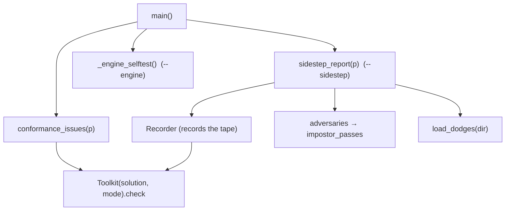
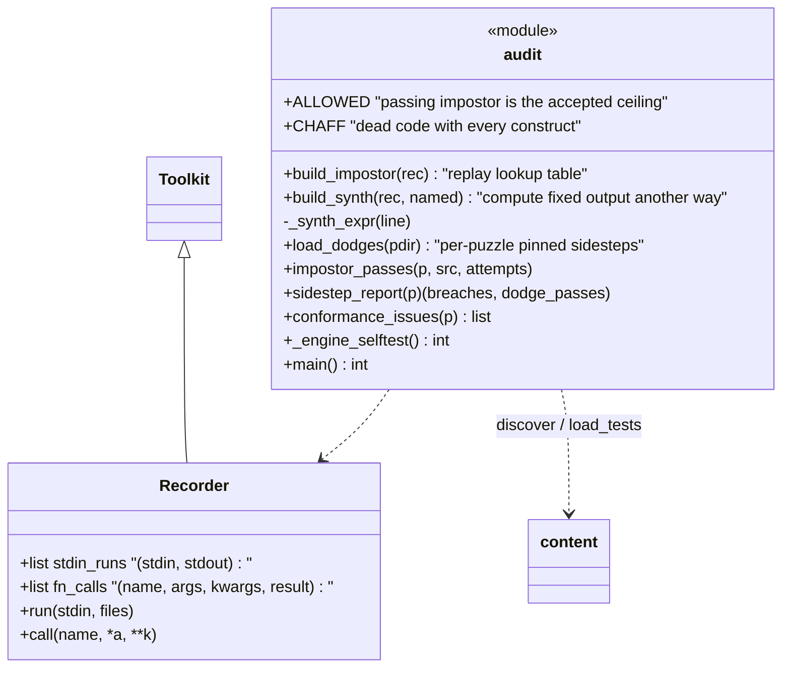
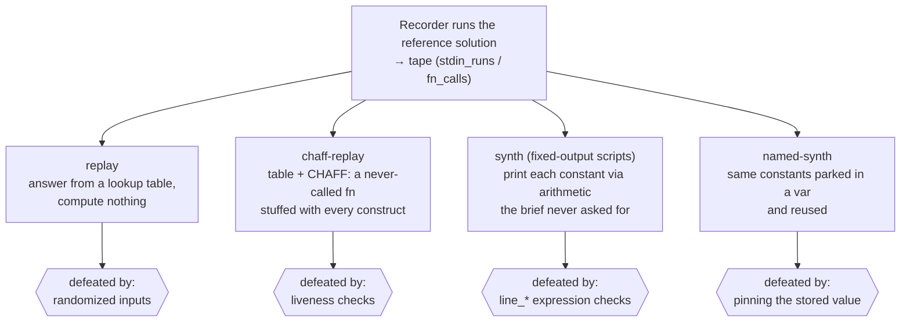
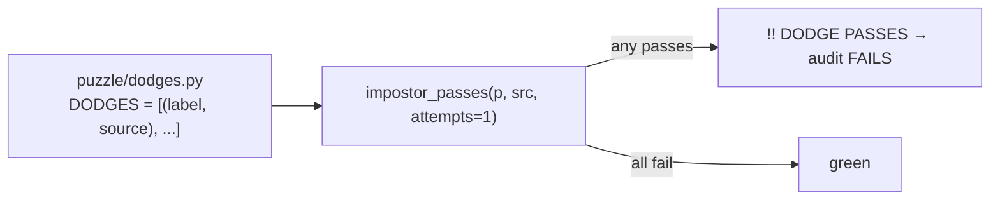
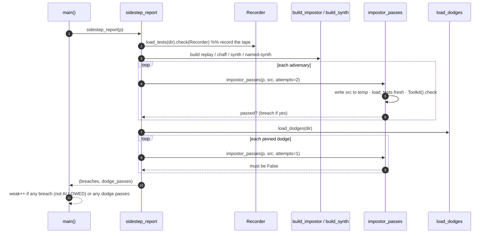
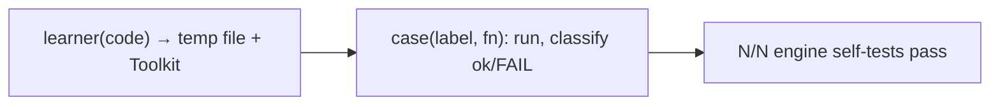

# audit.py — conformance, anti‑sidestep, engine self‑test

`audit.py` is the project's executable reality check. It is **not part of the
engine** (safe to delete) and is the test suite: there is no pytest layer.
← [overview](README.md)

```bash
python3 audit.py            # every solution.py passes its own tests.py
python3 audit.py --sidestep # ALSO attack every puzzle with the adversaries
python3 audit.py --engine   # self-test the execution guard & toolkit APIs
```

It reuses the real engine (`content.discover/load_tests`, the `Toolkit`), so it
grades against exactly what learners run.



---

## Structure



`Recorder` subclasses the real `Toolkit` so it grades identically while also
capturing the **tape** of every `(stdin → stdout)` and `(call → result)` — the
raw material every adversary is built from.

## The four generic adversaries (mutation testing of the grader)



**A passing impostor is a hole.** Each puzzle should be saved by at least one
defense per adversary. `ALLOWED` whitelists the rare puzzle where the cheapest
passing program *is* a legitimate answer (e.g. 1.1 "print one literal").

## Per‑puzzle pinned regressions — `dodges.py`



Every known hand‑found sidestep is pinned here with the check that now blocks
it; the audit fails forever if one ever passes again. (The manual hunting
process is documented in the gitignored `SIDESTEP_PLAYBOOK.md`.)

## Sequence — `--sidestep` against one puzzle



## `--engine` — the guard's guarantees, pinned

`_engine_selftest()` runs ~25 direct cases asserting each promise the
[ExecutionGuard](toolkit.md) and toolkit make: `exit()`/hang/stray‑`input()`
translation, stdout capture, the file sandbox never leaking into the project,
class/mutation/`approx`/case‑sensitive‑`eq` behavior, liveness killing dead
chaff while honest constructs pass, the `line_*` checks, the structural checks
(`uses_nested_if`, `uses_default_param`, `uses_with_open`), atomic JSON writes,
corrupt‑file backup, username validation, and discovery tolerating bad meta.



Run order in CI‑of‑one: `--engine` after touching `toolkit/`, `--sidestep`
before any commit; both must be green (current bar: **82/82 conformance,
0/82 sidesteppable, 25/25 engine self‑tests**).
