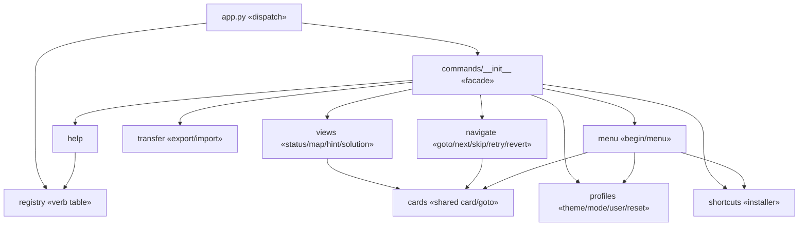
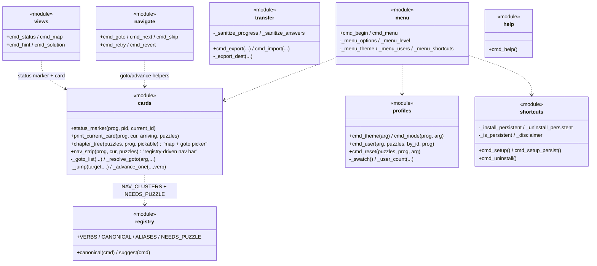
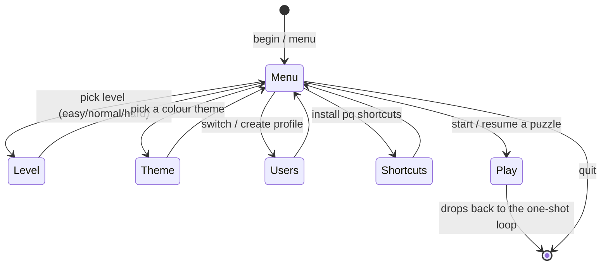
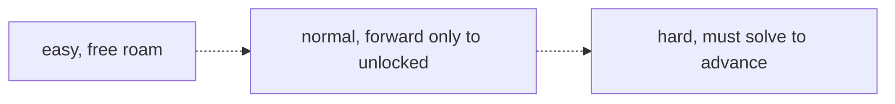

# commands/: the verbs

The verb implementations, split by concern and re‑exported from a facade
`__init__` so `app.py` imports them from one place. Each verb is a plain
function `(puzzles, by_id, prog, ...)`; none of them touch colours directly,
they go through [render/theme](visuals.md). ← [overview](README.md)

Each verb also reads `content`/`state` and draws through `render` (the module
diagram below); those edges are left off here to keep the verb topology clear.
`checker.cmd_check` lives in `engine/checker.py` (not this package) because it
owns the toolkit run; everything else verb‑shaped is here.

`app.py` consults `registry` before dispatch: it canonicalizes aliases
(`load`→`goto`), redirects puzzle-context verbs (`check`, `hint`, `next`, …)
to `begin` when no puzzle is loaded, and offers a "did you mean?" suggestion on
an unknown verb. `help` renders its grouped list from the same table.

---

## Module responsibilities

`cards.py` is the shared core: card rendering, the one chapter-tree renderer
(`chapter_tree`, used by both `map` and the goto picker), the registry-driven
bottom nav strip (`nav_strip`, the consistent footer on every pane), the goto
list, resolving a goto target, jumping, and advancing one puzzle. `views.py`,
`navigate.py`, and `menu.py` all build on it so navigation looks and behaves
identically from the CLI and the menu. `nav_strip` reads `NAV_CLUSTERS` +
`NEEDS_PUZZLE` from `registry`, so the strip can never list a verb dispatch
wouldn't accept.

## The only interactive surface: `begin` / `menu`

Every other verb is one‑shot. `cmd_begin`/`cmd_menu` are the lone read‑loop, and
they still delegate the real work to the same one‑shot verbs.

## Difficulty modes gate navigation

`cmd_mode` sets `prog["mode"]`; the navigation helpers in `cards.py` read it to
decide whether `next`/`skip`/`goto` may move past an unsolved puzzle.

(See README's command table for the exact per‑mode rules.)
