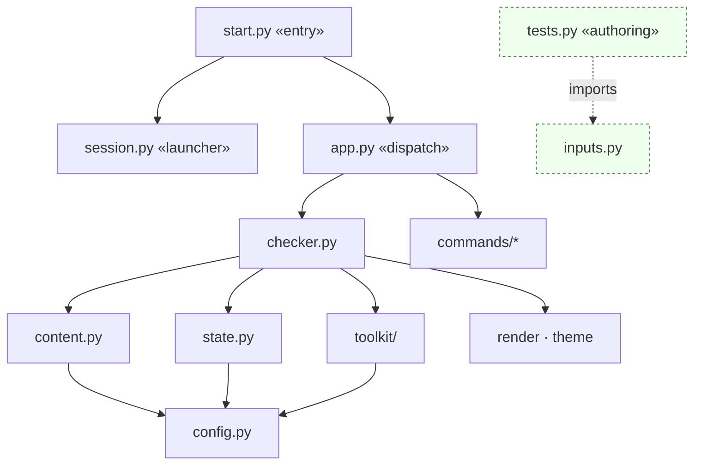
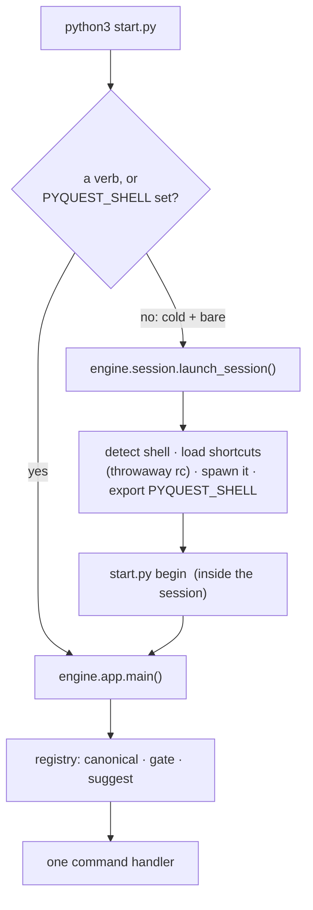
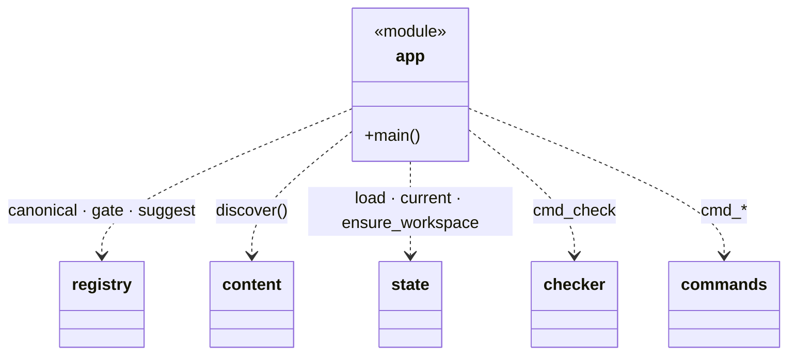
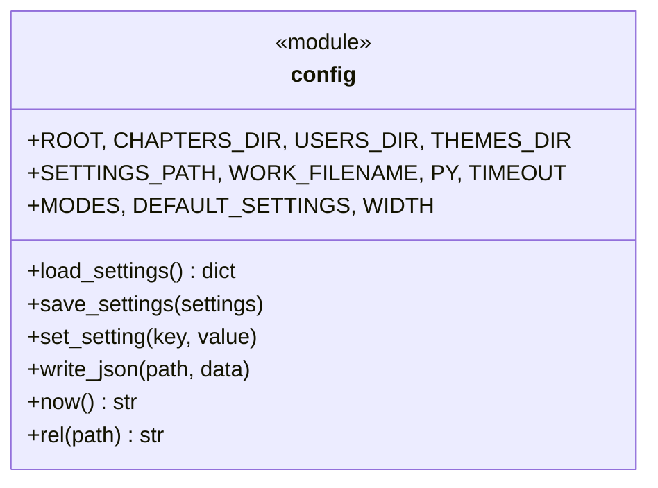
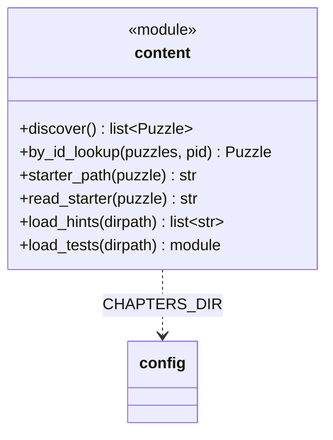
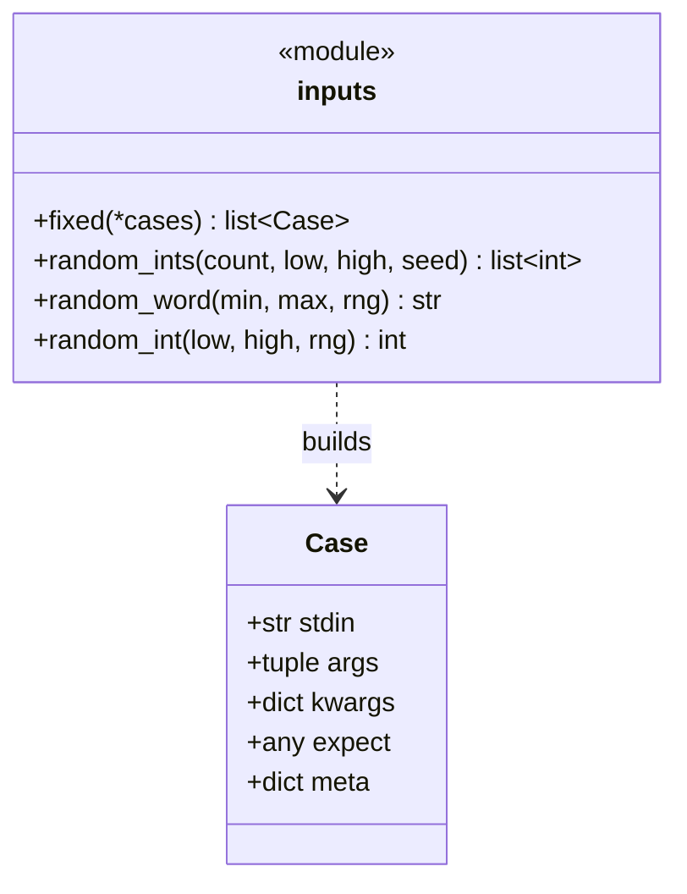
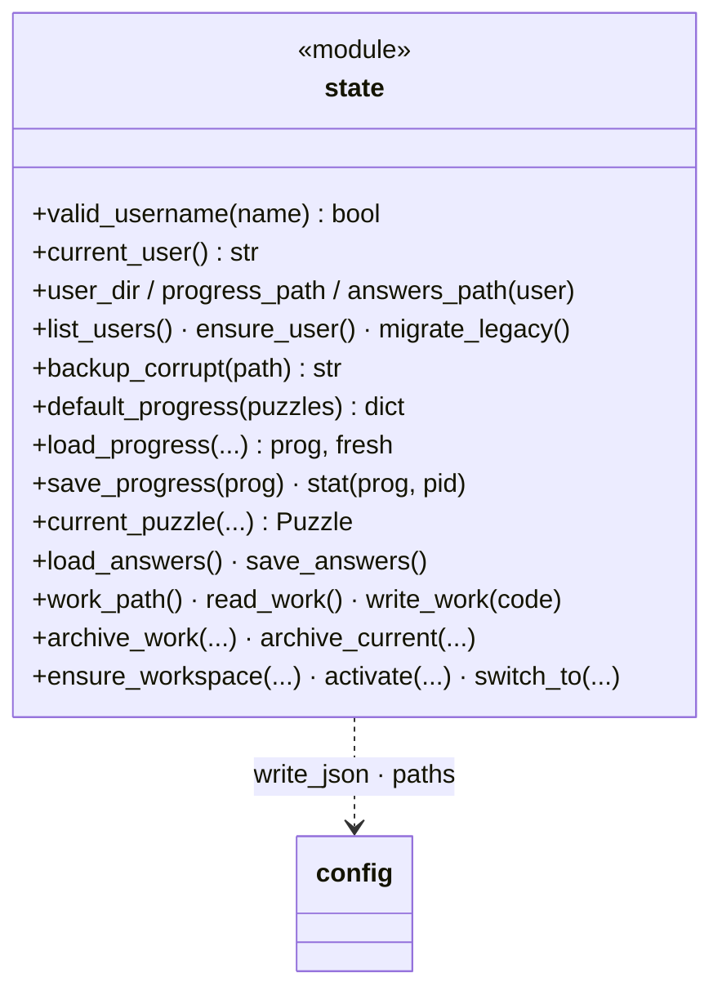
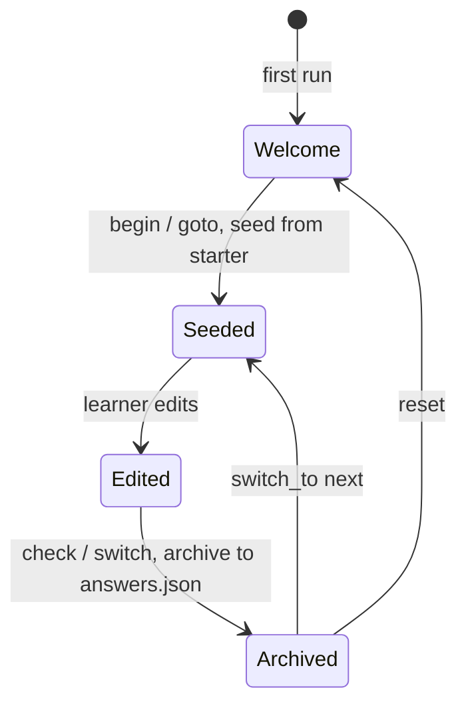
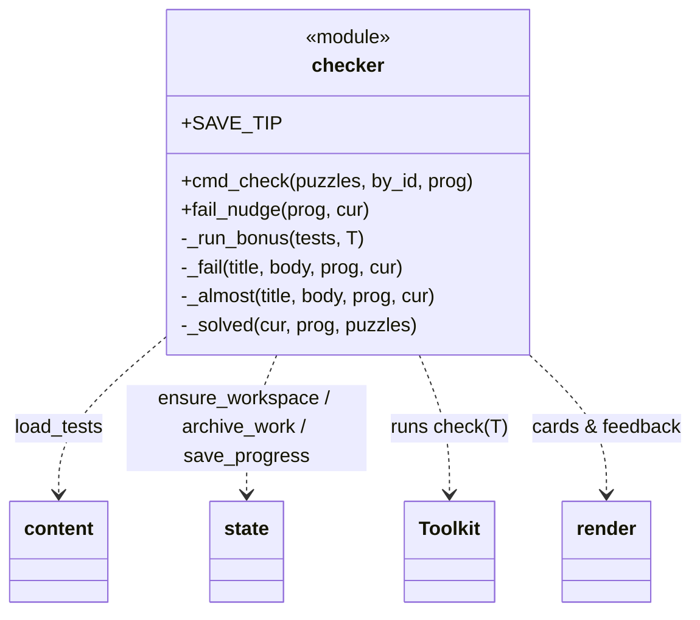
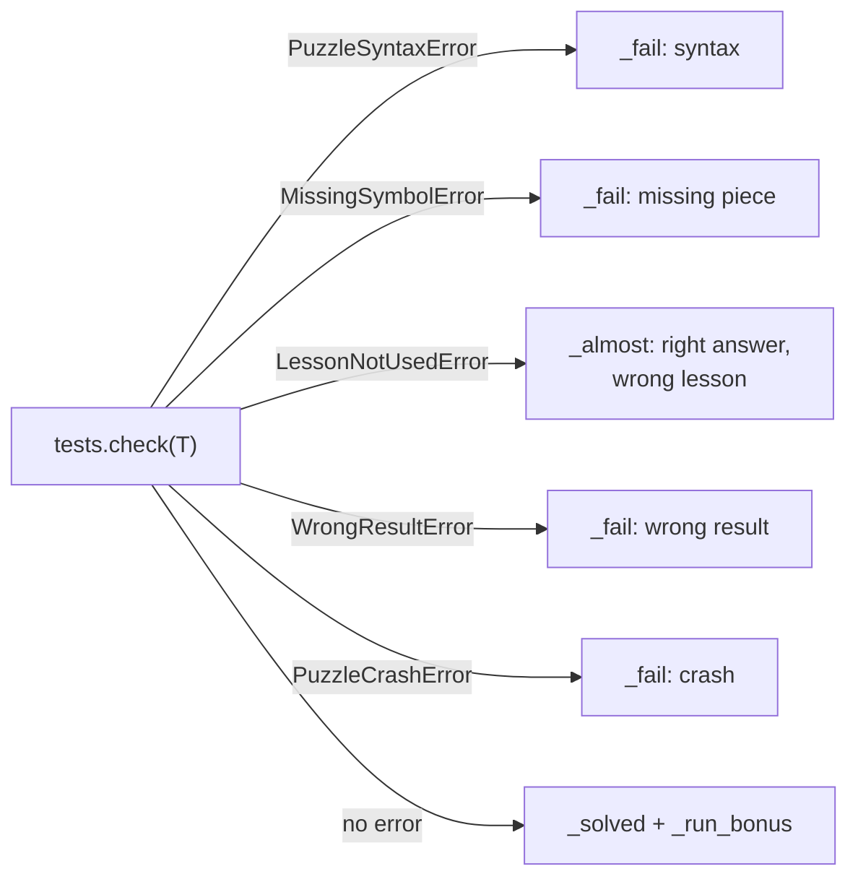

# Engine core

The orchestration, content, input and state layers. Visuals are in
[visuals.md](visuals.md); the tester in [toolkit.md](toolkit.md); the verbs in
[commands.md](commands.md). ← [overview](README.md)

> `inputs.py` is consumed by each puzzle's `tests.py` (loaded via
> `content.load_tests`), **not** by `toolkit` or `content` themselves: it is
> the authoring seam, not an engine dependency.

---

## start.py / app.py: entry & dispatch

`start.py` is a thin root entry point that only routes (version check, then
launch-or-dispatch). A cold bare run delegates to `engine.session`, which hosts
a session shell with the shortcuts loaded and opens the menu (the one place
that spawns a shell); given a verb it calls `engine.app.main()`. `app.main()`
is the **only** place argv becomes an action:
it builds the puzzle list once, loads progress, guarantees `work.py` exists,
then routes the verb to exactly one command function. Before routing it
consults `commands/registry`: canonicalize the verb (fold aliases), gate
puzzle-context verbs (`check`, `hint`, `next`, … redirect to `begin` when no
puzzle is loaded), and on an unknown verb suggest the closest match. Adding a
verb = one `elif` here + one function in `commands/` + one registry row.

The two ways in -- a cold bare launch versus running a verb -- and how a
session folds back into dispatch:

`main()` maps each verb to one function:

| verb(s) | → function |
|---|---|
| status · current · progress | `cmd_status` |
| check · hint · solution · map | `cmd_check` · `cmd_hint` · `cmd_solution` · `cmd_map` |
| next · skip · retry · revert · goto | the navigation verbs (`navigate.py`) |
| theme · mode · user · reset | `cmd_theme` · `cmd_mode` · `cmd_user` · `cmd_reset` |
| export · import | `cmd_export` · `cmd_import` (portable profile bundle) |
| begin · menu · setup · uninstall · help | the rest |

## config.py: foundation

Pure constants + the atomic‑write primitive everything else builds on. Knows
no other engine module (the bottom of the dependency graph).

`write_json` is the single atomic JSON writer (write temp → `os.replace`), so a
crash mid‑write can never corrupt `progress.json` / `answers.json` / settings.

## content.py: the structured question

Discovers puzzle folders and loads their files. **Stateless**: no learner data
here. `discover()` returns the ordered `Puzzle` dicts the whole app keys on.

`discover()` tolerates a broken `meta.json`, it logs to stderr and skips that
folder rather than failing the whole scan. `load_tests` re‑imports each
`tests.py` fresh per call, which is what gives the audit fresh randomness on
every attempt.

## inputs.py: the input seam ("input automizer")

Where a single source decides **both** the value fed to the solution and the
data needed to validate it, so answers can't be hardcoded.

A `tests.py` builds fixed + randomized `Case`s: script puzzles feed
`case.stdin`, import puzzles feed `case.args`, and both validate against
`case.expect`, one source decides input *and* expected result, so answers
can't be hardcoded.

## state.py: per‑user progress & the work.py lifecycle

Owns everything mutable and per‑user. All writes go through `config.write_json`;
an unreadable file is moved aside as `<name>.corrupt`, never overwritten.

### The `work.py` lifecycle

## checker.py: one check, end to end

Translates the toolkit's typed failures into learner‑facing screens. It is the
bridge between the tester (`toolkit/`) and the presentation (`render`/`theme`).

### Failure → screen mapping

`LessonNotUsedError` subclasses `WrongResultError`, so its **more specific**
`except` must come first in `cmd_check` (and does), this is the "so close"
screen that distinguishes a wrong answer from a right answer that skipped the
lesson.
