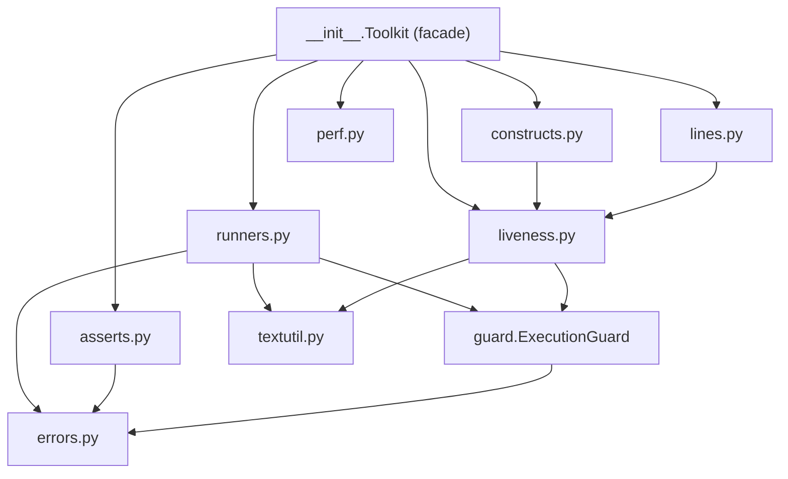
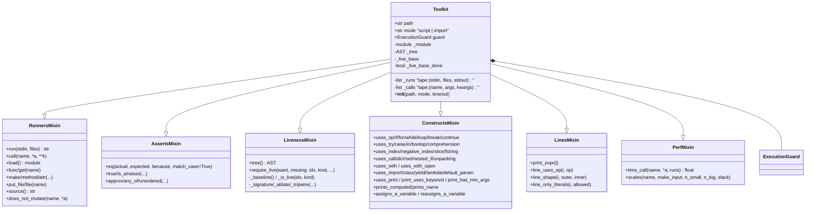
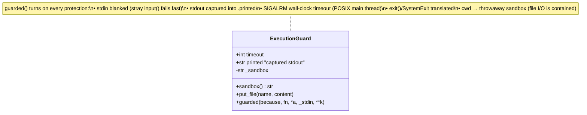
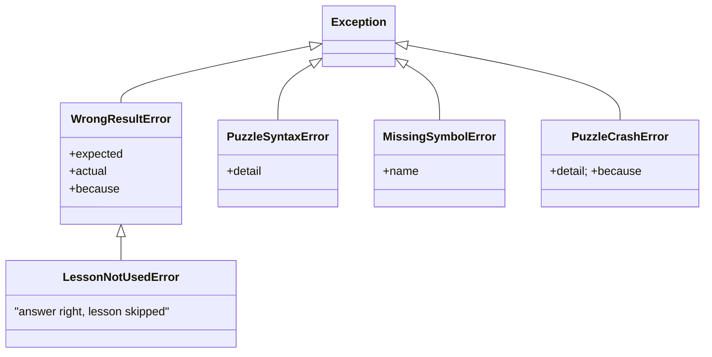
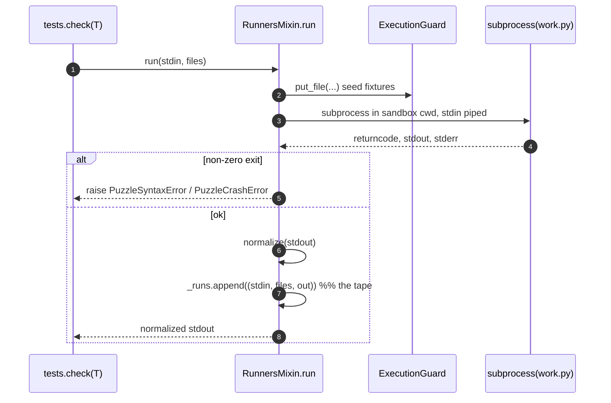
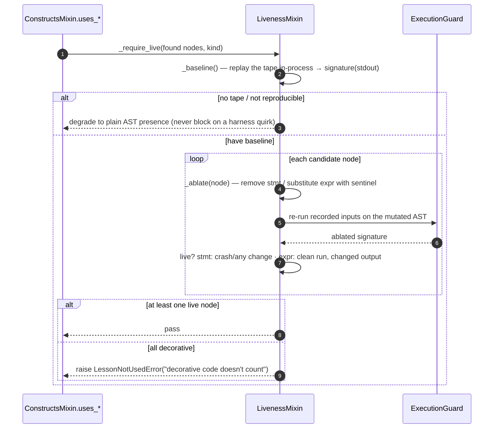
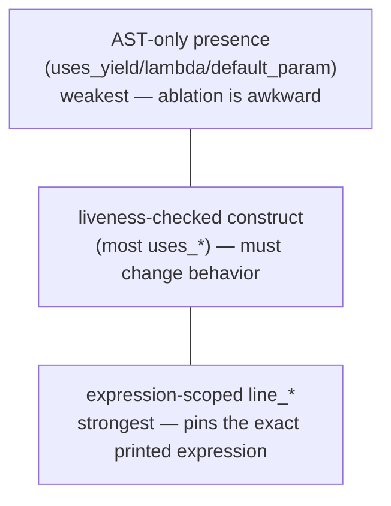

# toolkit/ — the `T` tester

`T`, the object handed to every puzzle's `check(T)`. It runs the learner's code
through one guard, asserts on behavior, and judges whether the lesson's
construct was actually *used* (liveness). ← [overview](README.md)

The package is composed by concern; dependencies point **down** this list, and
`Toolkit` is a thin facade that inherits each group as a mixin so `tests.py`
keeps a flat `T.eq(...)` / `T.uses_op(...)` surface.

---

## Composition — the facade and its mixins

The mixins share state through the facade (`self.path`, `self.guard`, the tape
`self._runs`/`self._calls`, the AST/liveness caches). Method‑resolution order is
fixed in the `Toolkit(...)` base list, so the tape‑aware liveness checks see the
runs that the behavior assertions recorded — **call behavior assertions before
construct checks**.

## The execution guard — the one place learner code runs

Script mode gets stronger isolation via a real subprocess (cross‑platform
timeout + sandbox cwd); import/liveness runs in‑process under the same guard.
**No learner code is ever invoked outside `guarded()`** — `audit.py --engine`
pins each guarantee.

## Translated failures — one type per learner screen

`LessonNotUsedError` **is‑a** `WrongResultError` — catch it first (the checker
does). It carries the wanted construct as `expected` and the offending code (or
the "decorative code doesn't count" note) as `actual`.

## Sequence — `T.run()` (script mode) records the tape

## Sequence — liveness: "is this construct actually used?"

Liveness signatures capture **stdout only**. For file/side‑effect lessons that
means a write‑only `with` looks dead — which is exactly why the files chapter
uses `uses_with_open` anchored on a *read* whose removal crashes downstream (see
[audit.md](audit.md) and `SIDESTEP_PLAYBOOK.md`).

## Three layers of construct strength

`require_live(want, missing, node_indices, kind, because)` is the public seam: a
complex puzzle composes a bespoke structural check from `T.tree()` + audited
liveness instead of hand‑rolling AST logic — and ships a `dodges.py` proving it
bites.
