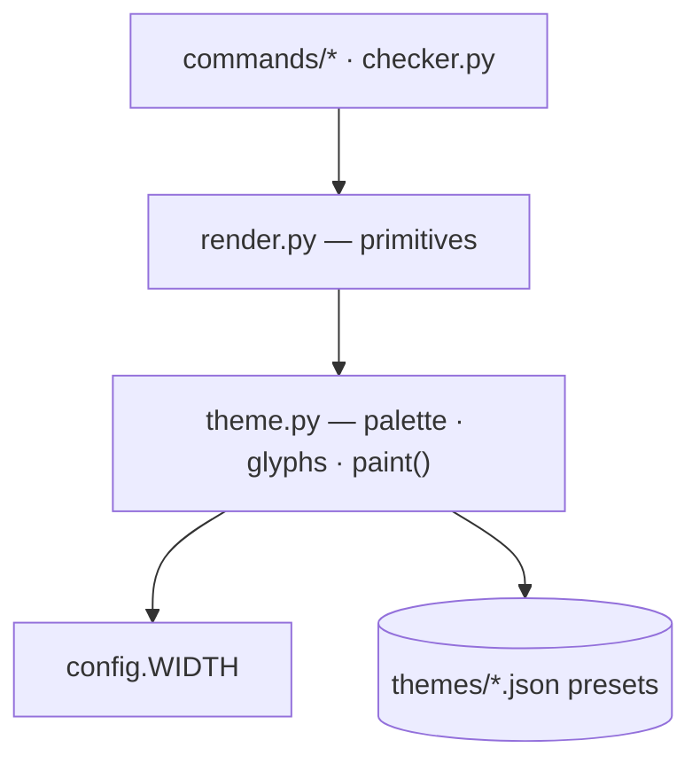
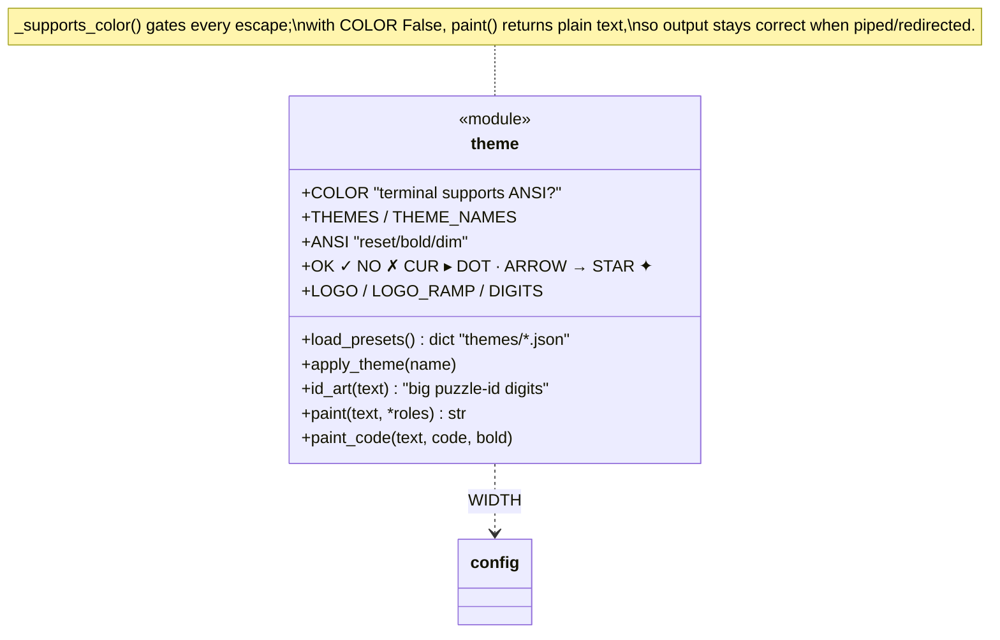
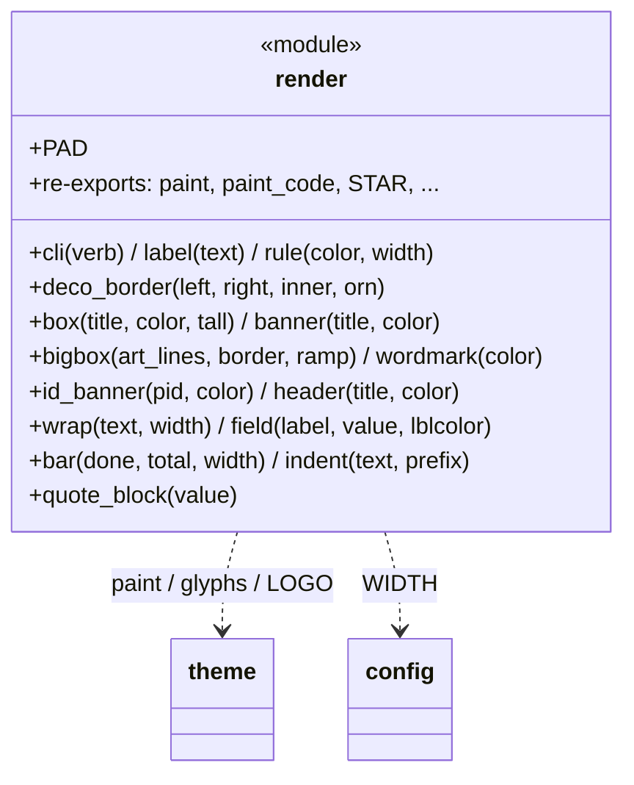
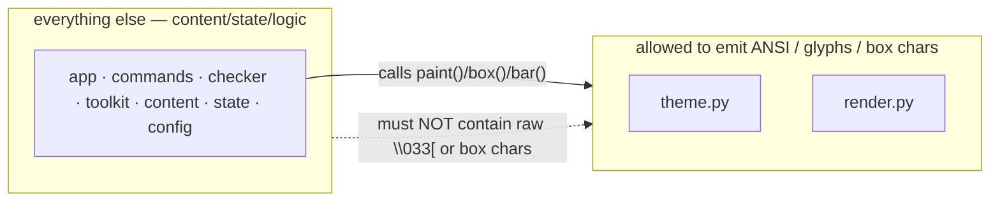

# Visuals — theme & render

The isolated presentation layer. **All** colour codes, glyphs and box‑drawing
characters live here and nowhere else — a restyle touches only these two files.
`render` consumes `theme`; the rest of the engine consumes `render` (and
`theme.paint`). ← [overview](README.md)

---

## theme.py — palette, glyphs, paint

The visual identity: ANSI capability detection, the named palettes, the
deliberate glyph set, and `paint()` (the single colouriser). The glyph set
`✓ ✗ ▸ · → ✦` is the **only** place such characters are allowed.

## render.py — drawing primitives

Pure layout built from `theme` parts: boxes, banners, the progress bar, wrapped
text, fields. Stateless; takes data, returns strings. Re‑exports `paint`/`STAR`
so callers import one module.

## The rule the audit‑of‑intent protects

Because presentation is quarantined, a theme change is data (`themes/*.json` +
`THEMES`) and a re‑style is local: the learning logic never moves.
