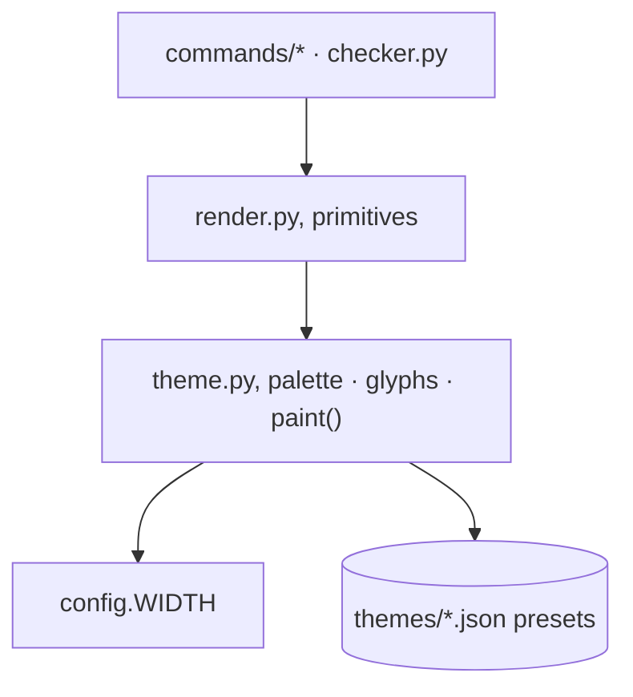
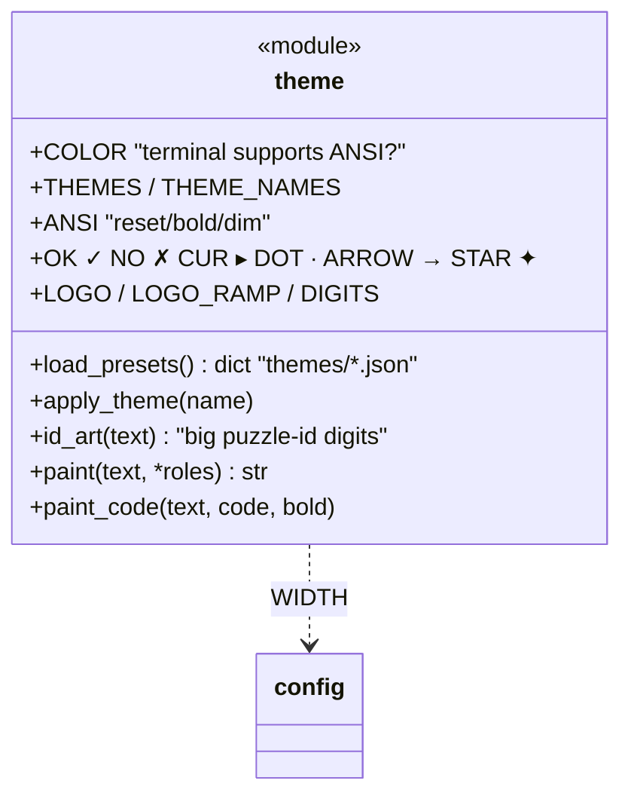
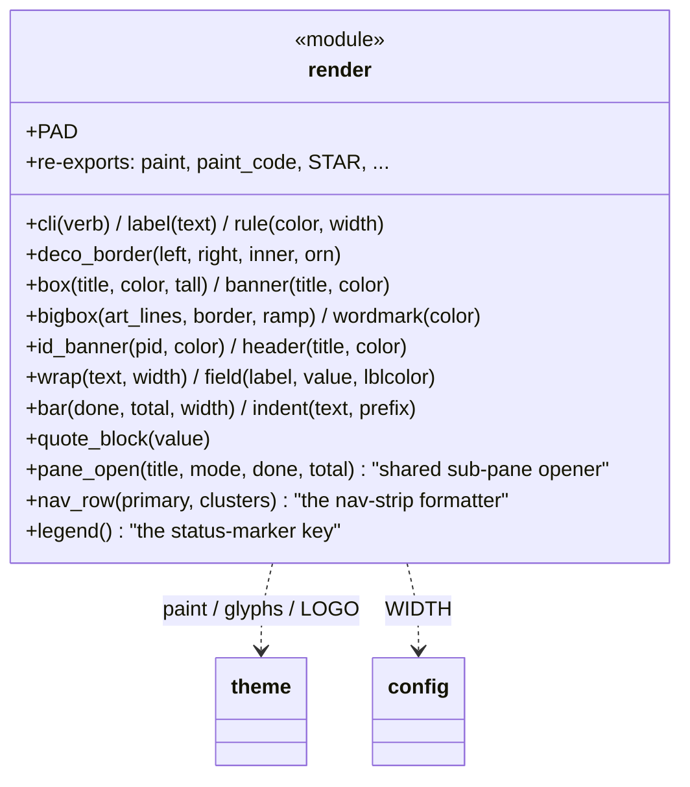
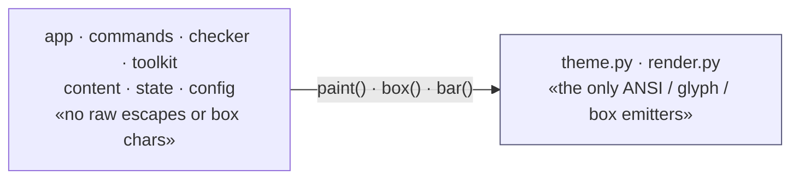

# Visuals: theme & render

The isolated presentation layer. **All** colour codes, glyphs and box‑drawing
characters live here and nowhere else, a restyle touches only these two files.
`render` consumes `theme`; the rest of the engine consumes `render` (and
`theme.paint`). ← [overview](README.md)

---

## theme.py: palette, glyphs, paint

The visual identity: ANSI capability detection, the named palettes, the
deliberate glyph set, and `paint()` (the single colouriser). The glyph set
`✓ ✗ ▸ · → ✦` is the **only** place such characters are allowed.

`_supports_color()` gates every escape: with `COLOR` false, `paint()` returns
plain text, so output stays correct when piped or redirected.

## render.py: drawing primitives

Pure layout built from `theme` parts: boxes, banners, the progress bar, wrapped
text, fields. Stateless; takes data, returns strings. Re‑exports `paint`/`STAR`
so callers import one module.

Three composite primitives give every screen one visual language. `pane_open`
is the shared sub-pane opener (a titled header rule above a `mode + progress`
line); the big `wordmark`/`id_banner` art stays reserved for "moments" (the
menu/status hub, arriving at a puzzle), so sub-panes feel like one app instead
of each re-blasting the logo. `nav_row` formats the bottom **nav strip** — a
highlighted primary-action chip plus dim, ·-separated verb clusters — but it
takes already-resolved labels: the registry-aware selection (which verb is
primary, which clusters show) lives one layer up in
[commands/cards.py](commands.md) `nav_strip`, so `render` stays free of any
command/registry knowledge. `legend` is the shared status-marker key.

## The rule the audit‑of‑intent protects

Everything else asks the visual layer to paint; only `theme`/`render` ever emit
an escape or a box character. Because presentation is quarantined, a theme
change is data (`themes/*.json` + `THEMES`) and a re‑style is local: the
learning logic never moves.
